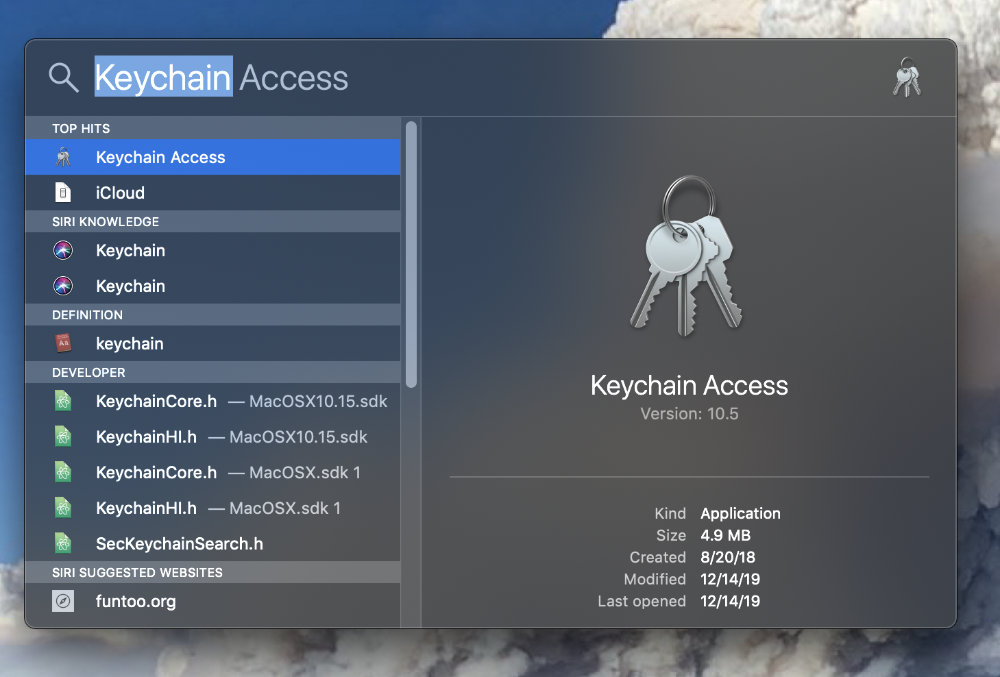
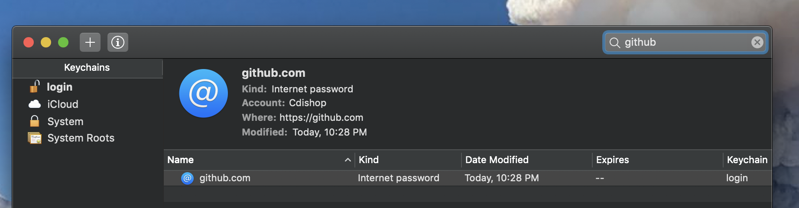

```{r setup, include=FALSE}
knitr::opts_chunk$set(echo = TRUE, warning = F, message = F)
```

Quick note on updating your credentials after you change your password on GitHub. 

Steps

* search for keychain access in spotlight

* delete the old github credentials

* clone and adjust a repo

* trigger the credential helper

* push changes to repo


Search for "keychain access" in spotlight.



Enter "github" into the search bar. Delete all github password entries.



Clone a repo and make some changes.

```{r, eval = F}

cd Desktop

git clone https://github.com/Cdishop/website.git

cd website

echo "some change" >> README.md

```

Activate keychain.

```{r, eval = F}

git credential-osxkeychain

git config --global credential.helper osxkeychain

```

Trigger a username/password entry by pushing to remote.

```{r, eval = F}

git add .

git commit -m "commit for keychain change"

git push -u origin master

[enter credentials]

git push

```

## Route 2 - No Keychain

You may not see a saved password in your keychain. If that's the case, then you can allow your push to fail and then reset your credentials in the terminal.

Clone, adjust, and then push a repository. After pushing, you will see a "fatal" error.

Enter

```{r, eval = F}

git config --global user.email "Your email"

git config --global user.name "Your Name"


```

Then push again. You will be asked for a username and password. All subsequent repository pushes should then be automatic. 

Bo$^2$m =)