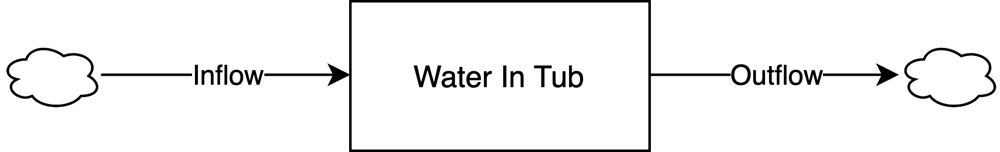
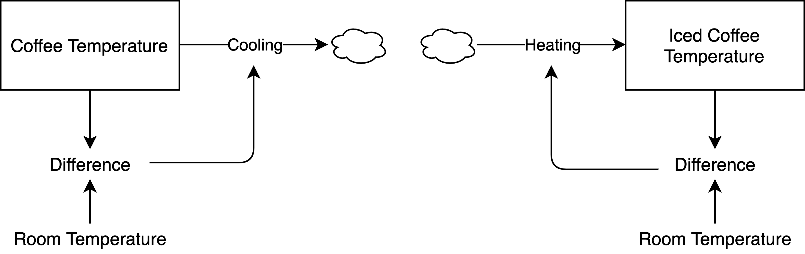
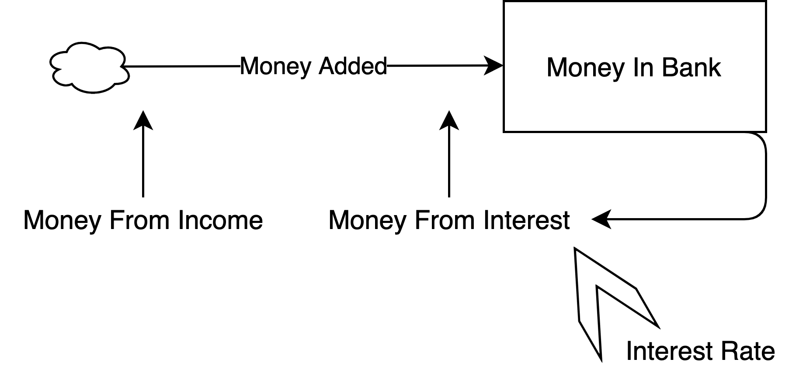
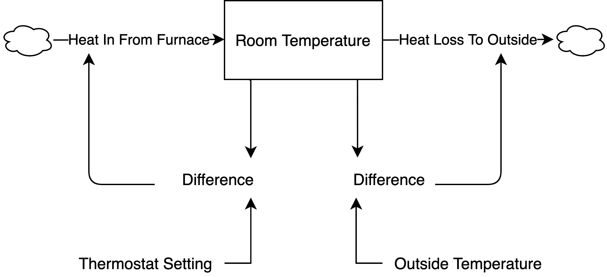
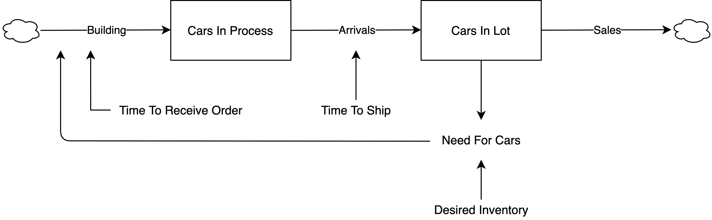
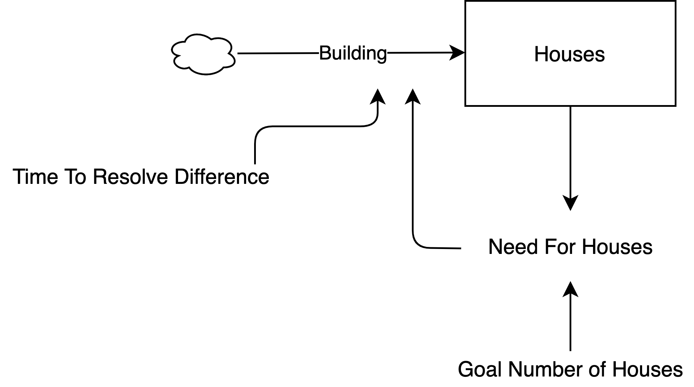
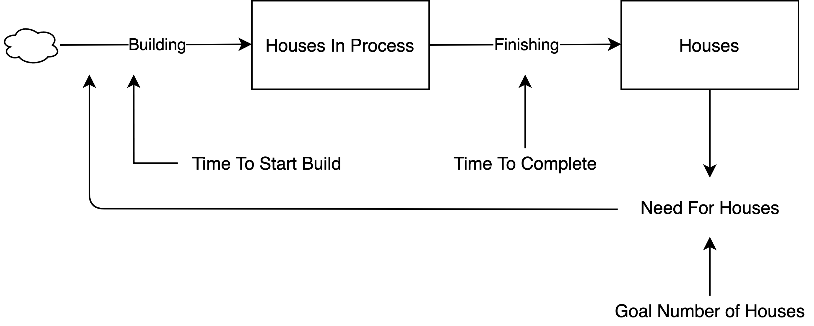
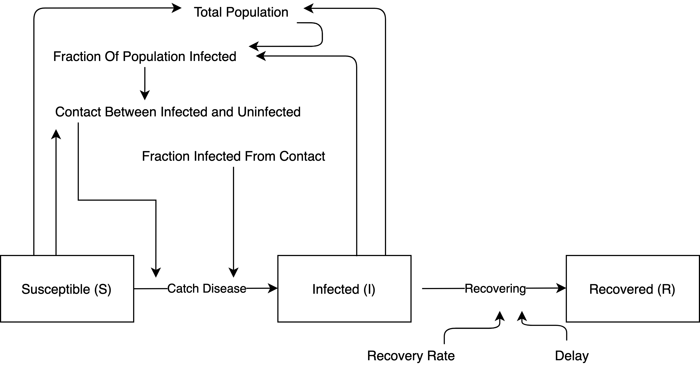

```{r setup, include=FALSE, cache = T}
knitr::opts_chunk$set(echo = TRUE, message = F, warning = F, cache = T)
```
Some practice simulating stock and flow models. The first example set uses discrete time. The second uses continuous time differential equations. I include some text from Donella Meadows' book, "Thinking in Systems" to explain some of the examples. 


# Example 1: Bath Tub

{width=80%}

"Imagine a bathtub filled with water, with its drain plugged up and its faucets turned off—an unchanging, undynamic, boring system. Now mentally pull the plug. The water runs out, of course. The level of water in the tub goes down until the tub is empty." (p. 19). 

```{r, warning = F, message = F}

library(ggplot2)
library(hrbrthemes)

# time
time <- 10

# stock storehouses - start and end for each stock
## water in tub
startwater <- numeric(time)
endwater <- numeric(time)

# initial conditions in each stock
## water in tub
startwater[1] <- 10
endwater[1] <- startwater[1]

# constants
## outflow (gallons exiting the tub per minute)
outflow <- 1
## inflow (gallons entering the tub per minute)
inflow <- 0

# iterate
for(i in 2:time){
  
  # start stocks at period i are ending stocks at period i-1
  startwater[i] <- endwater[i - 1]
  
  # model system
  endwater[i] <- startwater[i] + inflow - outflow
  
}

dftub1 <- data.frame(
  "gallons" = c(endwater),
  "minutes" = c(1:time)
)

ggplot(dftub1, aes(x = minutes, y = gallons)) + 
  geom_line() + 
  theme_classic()

```

"Now imagine starting again with a full tub, and again open the drain, but this time, when the tub is about half empty, turn on the inflow faucet so the rate of water flowing in is just equal to that flowing out. What happens? The amount of water in the tub stays constant at whatever level it had reached when the inflow became equal to the outflow. It is in a state of dynamic equilibrium -- its level does not change, although water is continuously flowing through it." (p. 21). 

```{r}
# time
time <- 10

# stock storehouses - start and end for each stock
## water in tub
startwater <- numeric(time)
endwater <- numeric(time)

# initial conditions in each stock
## water in tub
startwater[1] <- 10
endwater[1] <- startwater[1]

# constants
## none - flows change midway through the process

# iterate
for(i in 2:time){
  
  # start stocks at period i are ending stocks at period i-1
  startwater[i] <- endwater[i - 1]
  
  # model system
  
  ## open the drain
  if(i < 5){
    inflow <- 0
    outflow <- 1
  ## then, turn on the faucet so water flows into the tub
  }else{
    inflow <- 1
    outflow <- 1
  }
  
  endwater[i] <- startwater[i] + inflow - outflow
  
}

dftub2 <- data.frame(
  "gallons" = c(endwater),
  "minutes" = c(1:time)
)

ggplot(dftub2, aes(x = minutes, y = gallons)) + 
  geom_line() + 
  theme_classic() + 
  ylim(0, 10)
```


# Example 2: Coffee Temperature

{width=80%}


"A hot cup of coffee will gradually cool down to room temperature. Its rate of cooling depends on the difference between the temperature of the coffee and the temperature of the room. The greater the difference, the faster the coffee will cool. The loop works the other way too -- if you make iced coffee on a hot day, it will warm up until it has the same temperature as the room. The function of this system is to bring the discrepancy between coffee's temperature and room's temperature to zero, no matter what the direction of the discrepancy. Whatever the initial value of the system stock (coffee temperature in this case), whether it is above or below the 'goal' (room temperature), the feedback loop brings it toward the goal. The change is faster at first, and then slower, as the discrepancy between the stock and the goal decreases." (p. 29). 

```{r, message = F, warning = F}

# time
time <- 4

# stock storehouses - start and end for each stock
## coffee
startcoffee <- numeric(time)
endcoffee <- numeric(time)

## iced coffee
startic <- numeric(time)
endic <- numeric(time)

# initial conditions in each stock
## temperature of coffee
startcoffee[1] <- 96
endcoffee[1] <- startcoffee[1]

## temperature of iced coffee
startic[1] <- 34
endic[1] <- startic[1]

# constants
## room temperature
room_temp <- 71

# iterate
for(i in 2:time){
  
  # start stocks at period i are ending stocks at period i-1
  startcoffee[i] <- endcoffee[i - 1]
  startic[i] <- endic[i - 1]
  
  # model system
  
  ## system for hot coffee
  difference_coffee <- abs(room_temp - startcoffee[i])
  cooling <- difference_coffee
  endcoffee[i] <- startcoffee[i] - cooling
  
  ## system for iced coffee
  difference_ic <- room_temp - startic[i]
  heating <- difference_ic
  endic[i] <- startic[i] + heating
  
}

dfcoffee <- data.frame(
  "var" = c(rep('Hot Coffee', time),
            rep('Iced Coffee', time)),
  "temperature" = c(endcoffee,
                    endic),
  "minutes" = c(c(1:time),
                c(1:time))
)

ggplot(dfcoffee, aes(x = minutes, y = temperature, linetype = var)) + 
  geom_line() + 
  geom_hline(yintercept = room_temp, linetype = "dashed", color = 'red') + 
  geom_text(aes(x = 1.3, y = room_temp + 1.8, label = "Room Temperature"), color = "darkred") + 
  theme(legend.title = element_blank())

```

The sampling window isn't small enough to capture the gradual decay/growth of temperature. I can artificially slow the process down by making the effects weaker.

```{r}

# time
time <- 20

# stock storehouses - start and end for each stock
## coffee
startcoffee <- numeric(time)
endcoffee <- numeric(time)

## iced coffee
startic <- numeric(time)
endic <- numeric(time)

# initial conditions in each stock
## temperature of coffee
startcoffee[1] <- 96
endcoffee[1] <- startcoffee[1]

## temperature of iced coffee
startic[1] <- 34
endic[1] <- startic[1]

# constants
## room temperature
room_temp <- 71

# iterate
for(i in 2:time){
  
  # start stocks at period i are ending stocks at period i-1
  startcoffee[i] <- endcoffee[i - 1]
  startic[i] <- endic[i - 1]
  
  # model system
  
  ## system for hot coffee
  difference_coffee <- abs(room_temp - startcoffee[i])
  #### HERE IS THE CHANGE
  cooling <- 0.2*difference_coffee
  endcoffee[i] <- startcoffee[i] - cooling
  
  ## system for iced coffee
  difference_ic <- room_temp - startic[i]
  #### HERE IS THE CHANGE
  heating <- 0.2*difference_ic
  endic[i] <- startic[i] + heating
  
}

dfcoffee <- data.frame(
  "var" = c(rep('Hot Coffee', time),
            rep('Iced Coffee', time)),
  "temperature" = c(endcoffee,
                    endic),
  "minutes" = c(c(1:time),
                c(1:time))
)

ggplot(dfcoffee, aes(x = minutes, y = temperature, linetype = var)) + 
  geom_line() + 
  geom_hline(yintercept = room_temp, linetype = "dashed", color = 'red') + 
  geom_text(aes(x = 5, y = room_temp + 1.8, label = "Room Temperature"), color = "darkred") + 
  theme(legend.title = element_blank())

```


# Example 3: Investing

{width=80%}

"The more money you have in the bank, the more interest you earn, which is added to the money already in the bank, where it earns even more interest. Consider how this reinforcing loop multiplies money, starting
with $100 in the bank, and assuming no deposits and no withdrawals over a period of ten years." (p. 32). 

```{r}


# time
time <- 10

# stock storehouses - start and end for each stock
## money in bank
startmoney <- numeric(time)
endmoney <- numeric(time)

# initial conditions in each stock
## money in bank
startmoney[1] <- 100
endmoney[1] <- startmoney[1]

# constants
## interest rate
interest_rate <- 0.05
## money from income (zero)
money_from_income <- 0

# iterate
for(i in 2:time){
  
  # start stocks at period i are ending stocks at period i-1
  startmoney[i] <- endmoney[i - 1]
  
  # model system
  money_from_interest <- startmoney[i] * interest_rate
  money_added <- money_from_income + money_from_interest
  endmoney[i] <- startmoney[i] + money_added
  
}

dfmoney <- data.frame(
  "money" = c(endmoney),
  "years" = c(1:time),
  "interest_rate" = c(rep(interest_rate, time))
)

```

Repeat for different interest rates.

```{r, echo = F}

run_interest <- function(ir){
  # time
time <- 10

# stock storehouses - start and end for each stock
## money in bank
startmoney <- numeric(time)
endmoney <- numeric(time)

# initial conditions in each stock
## money in bank
startmoney[1] <- 100
endmoney[1] <- startmoney[1]

# constants
## interest rate
interest_rate <- ir
## money from income (zero)
money_from_income <- 0

# iterate
for(i in 2:time){
  
  # start stocks at period i are ending stocks at period i-1
  startmoney[i] <- endmoney[i - 1]
  
  # model system
  money_from_interest <- startmoney[i] * interest_rate
  money_added <- money_from_income + money_from_interest
  endmoney[i] <- startmoney[i] + money_added
  
}

dfmoney <- data.frame(
  "money" = c(endmoney),
  "years" = c(1:time),
  "interest_rate" = c(rep(ir, time))
)

return(dfmoney)
  
}

```


```{r, message = F, warning = F}
library(dplyr)
dfint2 <- run_interest(1.0)
dfint3 <- run_interest(1.5)
dfmoney <- bind_rows(dfmoney, dfint2)
dfmoney <- bind_rows(dfmoney, dfint3)

ggplot(dfmoney, aes(x = years, y = money, linetype = factor(interest_rate))) + 
  geom_line() + 
  theme_classic() + 
  labs(linetype = "Interest Rate")
```


# Example 4: Room Temperature

{width=80%}

"What happens if there are two such loops, trying to drag a single stock toward two different goals? One example of such a system is the thermostat mechanism that regulates the heating of your room (or cooling, if it is connected to an air conditioner instead of a furnace). Whenever the room temperature falls below the thermostat setting, the thermostat detects a discrepancy and sends a signal that turns on the heat
fl ow from the furnace, warming the room. When the room temperature rises again, the thermostat turns off the heat fl ow. This is a straightforward, stock-maintaining, balancing feedback loop. However, this is not the only loop in the system. Heat also leaks to the outside. The outflow of heat is governed by the second balancing feedback loop. It is always trying to make the room temperature equal to the outside, just like a coffee cup cooling.

At first, both the room and the outside temperatures are cool. The inflow of heat from the furnace exceeds the leak to the outside, and the room warms up. For an hour or two, the outside is mild enough that the furnace replaces most of the heat that’s lost to the outside,and the room temperature stays near the desired temperature. But as the outside temperature falls and the heat leak increases, the furnace cannot replace the heat fast enough. Because the furnace is generating less heat than is leaking out, the room temperature falls. Finally, the outside temperature rises again, the heat leak slows, and the furnace, still operating at full tilt, finally can pull ahead and start to warm the room again. Just as in the rules for the bathtub, whenever the furnace is putting in more heat than is leaking out, the room temperature rises. Whenever the inflow rate falls behind the outflow rate, the temperature falls." (p. 41)

First, use a cosine function to create data mimicking the idea that "temperature outside drops throughout the night and then increases in the morning."

```{r}
points <- 1:51
outside <- cos(0.11 * points)
plot(outside)
```


```{r}


# time
time <- 51

# stock storehouses - start and end for each stock
## room temperature
startroom <- numeric(time)
endroom <- numeric(time)

# initial conditions in each stock
## room temperature
startroom[1] <- 0.4
endroom[1] <- startroom[1]

# constants
## thermostat setting
thermostat <- 2

# iterate
for(i in 2:time){
  
  # start stocks at period i are ending stocks at period i-1
  startroom[i] <- endroom[i - 1]
  
  # model system
  difference_outroom <- abs(outside[i] - startroom[i])
  heatloss <- difference_outroom
  
  difference_thermoroom <- thermostat - startroom[i]
  heatin <- difference_thermoroom
  
  endroom[i] <- startroom[i] + heatin - heatloss
  
}

dffurnace <- data.frame(
  "temperature" = c(endroom,
                    rep(thermostat, time),
                    outside),
  "time" = c(1:time,
             1:time,
             1:time),
  "var" = c(rep("Room Temperature", time),
            rep("Thermostat", time),
            rep("Outside Temperature", time))
)


ggplot(dffurnace, aes(x = time, y = temperature, color = var)) + 
  geom_line() + 
  theme_classic() + 
  theme(axis.text.y = element_blank()) + 
  labs(color = "")


```

Once again, I can smooth the process by weakening the effects.

```{r}

# time
time <- 51

# stock storehouses - start and end for each stock
## room temperature
startroom <- numeric(time)
endroom <- numeric(time)

# initial conditions in each stock
## room temperature
startroom[1] <- 0.4
endroom[1] <- startroom[1]

# constants
## thermostat setting
thermostat <- 2

# iterate
for(i in 2:time){
  
  # start stocks at period i are ending stocks at period i-1
  startroom[i] <- endroom[i - 1]
  
  # model system
  difference_outroom <- abs(outside[i] - startroom[i])
  heatloss <- 0.5*difference_outroom
  
  difference_thermoroom <- thermostat - startroom[i]
  heatin <- 0.5*difference_thermoroom
  
  endroom[i] <- startroom[i] + heatin - heatloss
  
}

dffurnace <- data.frame(
  "temperature" = c(endroom,
                    rep(thermostat, time),
                    outside),
  "time" = c(1:time,
             1:time,
             1:time),
  "var" = c(rep("Room Temperature", time),
            rep("Thermostat", time),
            rep("Outside Temperature", time))
)


ggplot(dffurnace, aes(x = time, y = temperature, color = var)) + 
  geom_line() + 
  theme_classic() + 
  theme(axis.text.y = element_blank()) + 
  labs(color = "")

```


# Example 5: Car Inventory With Delays

My stock and flow diagram is different from Fig 31 in "Thinking in Systems" because I like to include an additional "things in process / things in queue" stock when modeling delays.

{width=80%}

"This system is a version of the thermostat system—one balancing loop of sales draining the inventory stock and a competing balancing loop maintaining the inventory by resupplying what is lost in sales. Although this system still consists of just two balancing loops, like the simplified thermostat system, it doesn’t behave like the thermostat system. Look at what happens, for example, when the business experiences the same permanent 10-percent jump in sales from an increase in customer demand. Oscillations! A single step up in sales causes inventory to drop. The car dealer watches long enough to be sure the higher sales rate is going to last. Then she begins to order more cars to both cover the new rate of sales and
bring the inventory up. But it takes time for the orders to come in. During that time inventory drops further, so orders have to go up a little more, to bring inventory back up to ten days’ coverage. Eventually, the larger volume of orders starts arriving, and inventory recovers—and more than recovers, because during the time of uncertainty about the actual trend, the owner has ordered too much. She now sees her mistake, and cuts back, but there are still high past orders coming in, so she orders even less. In fact, almost inevitably, since she still can’t be sure of what is going to happen next, she orders too little. Inventory gets too low again. And so forth, through a series of oscillations around the new desired inventory level." (p. 54). 

```{r, message = F, warning = F}

# time
time <- 25

# stock storehouses - start and end for each stock
## cars in inventory
startcars <- numeric(time)
endcars <- numeric(time)
## cars in queue
startque <- numeric(time)
endque <- numeric(time)

# initial conditions in each stock
## cars in inventory
startcars[1] <- 78
endcars[1] <- startcars[1]
## cars in queue
startque[1] <- 0
endque[1] <- startque[1]

# constants
## desired inventory of cars in lot
desired_inventory <- 100
## time to ship (3 days)
time_to_ship <- 3
## time to receive order (half a day)
time_to_receive <- 0.5
## sales each day
sales <- 18

# iterate
for(i in 2:time){
  
  # start stocks at period i are ending stocks at period i-1
  startcars[i] <- endcars[i - 1]
  startque[i] <- endque[i - 1]
  
  # model system
  need_for_cars <- desired_inventory - startcars[i]
  building <- need_for_cars / time_to_receive
  arrivals <- startque[i] / time_to_ship
  
  endque[i] <- startque[i] + building - arrivals
  endcars[i] <- startcars[i] + arrivals - sales
  
}

dfcars <- data.frame(
  "cars" = c(endcars),
  "days" = c(1:time)
)

library(hrbrthemes)
ggplot(dfcars, aes(x = days, y = cars)) + 
  geom_line() + 
  theme_ipsum()

```


# Example 6: House Inventory

[Find lecture online](https://www.youtube.com/watch?v=xN4EGAOksFc). 

{width=80%}

```{r}


# time
time = 50

# stocks
starthouses = numeric(time)
starthouses[1] = 1000
endhouses = numeric(time)
endhouses[1] = 1000

# constants
goal_houses = 10000
## if there is a gap of 8000 houses (goal of 10000 but currently 2000)
## then they will resolve that gap in 9 periods
timetoresolve = 9


for(i in 2:time){
  
  starthouses[i] = endhouses[i-1]
  
  need_for_houses = goal_houses - starthouses[i]
  
  building = need_for_houses / timetoresolve
  
  endhouses[i] = starthouses[i] + building 
  
}
dfhouses <- data.frame(
  "time" = c(1:time),
  "houses" = c(endhouses)
)

ggplot(dfhouses, aes(x = time, y = houses)) + 
  geom_point()

```


# Example 7: House Inventory With Muliple Delays

[Find lecture online](https://www.youtube.com/watch?v=JSm6-uPSbKc). 

{width=80%}

```{r}

# time
time = 100

# stocks
## houses in process (works in progress)
startwip = numeric(time)
startwip[1] = 0
endwip = numeric(time)
endwip[1] = 0

## completed houses
starthouses = numeric(time)
starthouses[1] = 1000
endhouses = numeric(time)
endhouses[1] = 1000

# constants
goal_houses = 10000
timetostartbuild = 3
timetocomplete = 12


for(i in 2:time){
  
  startwip[i] = endwip[i - 1]
  starthouses[i] = endhouses[i - 1]
  
  needforhouses = goal_houses - starthouses[i]
  building = needforhouses / timetostartbuild
  finishing = startwip[i] / timetocomplete
  endwip[i] = startwip[i] + building - finishing
  
  
  endhouses[i] = starthouses[i] + finishing
  
}


df <- data.frame(
  "houses" = c(endhouses),
  "time" = c(1:time)
)

ggplot(df, aes(x = time, y = houses)) + 
  geom_point() + 
  theme_ipsum()
```


# Example 8: Customers In Store

Similar example to money in the bank, but now both the inflow and outflow (not just the inflow) will be proportional to the level of the stock.

{width=80%}

Growth Fraction:

* 7%, then 3%, then 1%

Decline Fraction:

* 3% throughout

```{r}
# time
time <- 30

# stock storehouses - start and end for each stock
## customers
startcustomers <- numeric(time)
endcustomers <- numeric(time)

# initial conditions in each stock
## customers
startcustomers[1] <- 5
endcustomers[1] <- startcustomers[1]

# constants
## decline fraction
decline <- 0.03


# iterate
for(i in 2:time){
  
  # start stocks at period i are ending stocks at period i-1
  startcustomers[i] <- endcustomers[i - 1]
  
  # model system
  if(i < 11){
    growth <- 0.07
  }else if(i > 10 && i < 21){
    growth <- 0.03
  }else{
    growth <- 0.01
  }
  
  losses <- startcustomers[i]*decline
  recruits <- startcustomers[i]*growth
  
  endcustomers[i] <- startcustomers[i] + recruits - losses
  
  
}

dfcustomers <- data.frame(
  "customers" = c(endcustomers),
  "minutes" = c(1:time)
)

ggplot(dfcustomers, aes(x = minutes, y = customers)) + 
  geom_line() + 
  theme_ipsum()
```


# Example 9: SIR Disease Model

{width=80%}


```{r}


# time
time <- 100

# stock storehouses - start and end for each stock
## susceptible
starts <- numeric(time)
ends <- numeric(time)
## infected
starti <- numeric(time)
endi <- numeric(time)
## recovered
startr <- numeric(time)
endr <- numeric(time)

# initial conditions in each stock
## susceptible
starts[1] <- 99
ends[1] <- starts[1]
## infected
starti[1] <- 1
endi[1] <- starti[1]
## recovered
startr[1] <- 0
endr[1] <- 0

# constants
## infection rate, or fraction infected from contact
infectionrate <- 0.8
## contact rate, or fraction of people (infected and susceptible) who touch
contactrate <- 0.5
## recovery rate
recoveryrate <- 0.3
## delay
delay <- 2

# iterate
for(i in 2:time){
  
  # start stocks at period i are ending stocks at period i-1
  starts[i] <- ends[i - 1]
  starti[i] <- endi[i - 1]
  startr[i] <- endr[i - 1]
  
  # model system
  totalpopulation <- starts[i] + starti[i]
  fractionofpopulationinfected <- totalpopulation / starti[i]
  contacts <- (fractionofpopulationinfected + starts[i])*contactrate
  fractioninfected <- contacts*infectionrate
  catch_disease <- 0.2*fractioninfected
  recovering <- 0.2*(starti[i]*recoveryrate / delay)
  
  ends[i] <- starts[i] - catch_disease
  endi[i] <- starti[i] - recovering + catch_disease
  endr[i] <- startr[i] + recovering
  
}

dfsir <- data.frame(
  "people" = c(ends,
               endi,
               endr),
  "time" = c(1:time),
  "var" = c(rep("Suseptible", time),
            rep("Infected", time),
            rep("Recovered", time))
)

ggplot(dfsir, aes(x = time, y = people, color = var)) + 
  geom_point() +
  labs(color = "")
```


# Examples Using Continuous Time Modeling

Room Temperature

```{r, message = F, warning = F}
library(deSolve)

start <- 0
finish <- 51
step <- 0.25
simtime <- seq(start, finish, by = step)

stocks <- c(room = 0.4)

auxs <- c(thermostat = 2)

model <- function(time, stocks, auxs){
  
  with(as.list(c(stocks, auxs)), {
    
    outside <- cos(0.11*time)
    difference_outroom <- abs(outside - room)
    heatloss <- difference_outroom
    
    difference_thermoroom <- thermostat - room
    heatin <- difference_thermoroom
    
    droom <- heatin - heatloss
    
    return(list(c(droom),
           out = outside,
           thermostat = thermostat))
    
    
  })
  
  
}

o <- data.frame(ode(y = stocks, times = simtime, 
                    func = model,
                    parms = auxs,
                    method = "euler"))

library(ggplot2)
library(tidyverse)

o <- o %>% 
  pivot_longer(cols = c(room, out, thermostat),
               names_to = "var",
               values_to = "temperature")

ggplot(o, aes(x = time, y = temperature, color = var)) + 
  geom_line()
```


Car Inventory

```{r, warning = F, message = F}
library(deSolve)

start <- 0
finish <- 3
step <- 0.25
simtime <- seq(start, finish, by = step)

stocks <- c(
  cars = 78,
  que = 0)

auxs <- c(
  desired_inventory = 100,
  time_to_ship = 1,
  time_to_recieve = 0.1,
  sales <- 18
)

model <- function(time, stocks, auxs){
  
  with(as.list(c(stocks, auxs)), {
    
    need_for_cars <- desired_inventory - cars
    building <- need_for_cars / time_to_recieve
    arrivals <- que / time_to_ship
    
    dcars <- building - arrivals
    dque <- arrivals - sales
    
    return(list(c(dcars, dque)))
    
    
    
    
    
  })
  
  
}


o <- data.frame(ode(y = stocks, times = simtime, 
                    func = model, parms = auxs, method = "euler"))

library(ggplot2)
ggplot(o, aes(x = time, y = cars)) + 
  geom_line()
```

Customers in Store

```{r, warning = F, message = F}
library(deSolve)

start <- 0
finish <- 10
step <- 0.25
simtime <- seq(start, finish, by = step)

stocks <- c(customers = 5)

auxs <- c(decline = 0.03)

model <- function(time, stocks, auxs){
  
  with(as.list(c(stocks, auxs)), {
    
    if(time < 3){
      growth <- 0.07
    }else if (time > 2 && time < 6) {
      growth <- 0.03
    }else{
      growth <- 0.01
    }
    
    losses <- customers*decline
    recruits <- customers*growth
    
    dcustomers <- recruits - losses
    
    return(list(c(dcustomers)))
    
    
  })
  
  
}

o <- data.frame(ode(y = stocks, times = simtime, 
                    func = model, parms = auxs, method = "euler"))


library(ggplot2)
ggplot(o, aes(x = time, y = customers)) + 
  geom_point()
```

Disease Contagion SIR Model

```{r, warning = F, message = F}
library(deSolve)

start <- 0
finish <- 25
step <- 0.1
simtime <- seq(start, finish, by = step)

stocks <- c(susceptible = 99,
            infected = 1,
            recovered = 0)

auxs <- c(contactrate = 0.5,
          infectionrate = 0.8,
          recoveryrate = 0.3,
          delay = 2)

model <- function(time, stocks, auxs){
  
  with(as.list(c(stocks, auxs)), {
    
    totalpopulation <- susceptible + infected
    fractionofpopulationinfected <- totalpopulation / infected
    contacts <- (fractionofpopulationinfected + susceptible)*contactrate
    fractioninfected <- contacts*infectionrate
    catchdisease <- fractioninfected
    recovering <- infected*recoveryrate / delay
    
    dsusceptible <- -catchdisease
    dinfected <- catchdisease - recovering
    drecovered <- recovering
    
    return(list(c(dsusceptible, 
                  dinfected,
                  drecovered)))
    
    
  })
  
  
  
}


o <- data.frame(ode(y = stocks, times = simtime,
                    func = model,
                    parms = auxs,
                    method = "euler"))

library(ggplot2)
library(tidyverse)
o <- o %>% 
  pivot_longer(cols = c(susceptible, 
                        infected,
                        recovered),
               names_to = "var",
               values_to = "val")

ggplot(o, aes(x = time, y = val, color = var)) + 
  geom_point()
```

Multiple Goal Self-Regulation

```{r, warning = F, message = F}


library(deSolve)

start <- 0
finish <- 5
step <- 1
simtime <- seq(start, finish, by = step)

stocks <- c(
  g1_performance = 23,
  g2_performance = 1
)

auxs <- c(
  g1_desire = 25,
  g2_desire = 25
)

model <- function(time, stocks, auxs){
  
  with(as.list(c(stocks, auxs)), {
    
    differenceg1 <- g1_desire - g1_performance
    differenceg2 <- g2_desire - g2_performance
    
    behavioral_choice = NULL
    if(differenceg1 > differenceg2){
      behavioral_choice <- "g1"
    }else{
      behavioral_choice <- "g2"
    }
    
    inputg1 <- 0
    inputg2 <- 0
    if(behavioral_choice == "g1"){
      inputg1 <- differenceg1 * 0.5 + rnorm(1, 0, 0.1)
    }else{
      inputg2 <- differenceg2 * 0.5 + rnorm(1, 0, 0.1)
    }
    
    dg1_performance = inputg1
    dg2_performance = inputg2
    
    return(list(c(dg1_performance, dg2_performance)))
    
    
  })
  
  
  
}

o <- data.frame(ode(y = stocks, times = simtime,
                    func = model, 
                    parms = auxs,
                    method = "euler"))


library(ggplot2)
library(tidyverse)
o <- o %>% 
  pivot_longer(cols = c(g1_performance, g2_performance),
               names_to = "var",
               values_to = "performance")

ggplot(o, aes(x = time, y = performance, color = var)) + 
  geom_point()


```


# Summary Steps

1. [Build Image](https://app.diagrams.net/)

2. Save image with a file size of 500%

3. When rendering Rmarkdown, use `{width=80%}`

4. Write simulation code

```{r, eval = F}
# time

# stocks
start
end

# constants

# iterate
for(i in 2:time)
  
  ## begin loop with stock connections
  start[i] <- end[i - 1]

# model system notes
## rates are multiplied
## delays are divisors

# always plot the end stock
```


## Drawing Stock and Flow Diagrams

* Odd number of negative relationships in the loop = balancing 

* If an effect is proportional to the stock's level, then draw an arrow from the stock to that effect

* When modeling delays, sometimes it is easier to include an "in queue" stock rather than a node effect


Bo$^2$m =)
