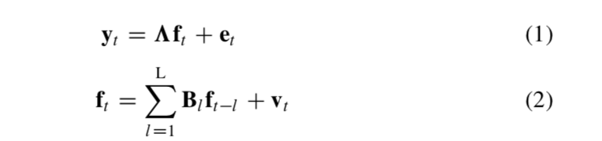

```{r setup, include=FALSE}
knitr::opts_chunk$set(echo = TRUE, warning = F, message = F)
```

```{r}
people <- 600
time <- 5
ar_affect <- 0.8
ar_perf <- 0.65
cl_affect_perf <- 0
cl_perf_affect <- 0

fl1_a <- 0.7
fl2_a <- 0.9
fl3_a <- 0.5
fl1_p <- 0.9
fl2_p <- 0.9
fl3_p <- 0.9

df_mat <- matrix(, ncol = 10, nrow = people*time)
count <- 0

for(i in 1:people){
  
  het_affect <- rnorm(1, 0, 4)
  het_perf <- rnorm(1, 0, 4)
  
  for(j in 1:time){
    count <- count + 1
    
    if(j == 1){
      
      # true affect
      df_mat[count, 1] <- het_affect + rnorm(1, 0, 1)
      # true performance
      df_mat[count, 2] <- het_perf + rnorm(1, 0, 1)
      
      # manifest affect - measurement error here rather than shock
      df_mat[count, 3] <- fl1_a*df_mat[count, 1] + rnorm(1, 0, 3)
      df_mat[count, 4] <- fl2_a*df_mat[count, 1] + rnorm(1, 0, 3)
      df_mat[count, 5] <- fl3_a*df_mat[count, 1] + rnorm(1, 0, 3)
      
      # manifest performance - measurement error here rather than shock
      df_mat[count, 6] <- fl1_p*df_mat[count, 2] + rnorm(1, 0, 3)
      df_mat[count, 7] <- fl1_p*df_mat[count, 2] + rnorm(1, 0, 3)
      df_mat[count, 8] <- fl1_p*df_mat[count, 2] + rnorm(1, 0, 3)
      
      # id and time
      df_mat[count, 9] <- i
      df_mat[count, 10] <- j
      
      
    }else{
      
      # true affect
      df_mat[count, 1] <- ar_affect*df_mat[count - 1, 1] + cl_perf_affect*df_mat[count - 1, 2] + het_affect + rnorm(1, 0, 1)
      # true performance
      df_mat[count, 2] <- ar_perf*df_mat[count - 1, 2] + cl_affect_perf*df_mat[count - 1, 1] + het_perf + rnorm(1, 0, 1)
      
      # manifest affect - measurement error here rather than dynamic noise
      df_mat[count, 3] <- fl1_a*df_mat[count, 1] + rnorm(1, 0, 3)
      df_mat[count, 4] <- fl2_a*df_mat[count, 1] + rnorm(1, 0, 3)
      df_mat[count, 5] <- fl3_a*df_mat[count, 1] + rnorm(1, 0, 3)
      
      # manifest performance - measurement error here rather than dynamic noise
      df_mat[count, 6] <- fl1_p*df_mat[count, 2] + rnorm(1, 0, 3)
      df_mat[count, 7] <- fl1_p*df_mat[count, 2] + rnorm(1, 0, 3)
      df_mat[count, 8] <- fl1_p*df_mat[count, 2] + rnorm(1, 0, 3)
      
      # id and time
      df_mat[count, 9] <- i
      df_mat[count, 10] <- j
      
    }
  }
  
  
  
}


# observe manifest indicators, id, and time

df <- data.frame(df_mat)
names(df) <- c('true_a', 'true_p', 'i1_affect', 'i2_affect', 'i3_affect', 'i1_perf', 'i2_perf', 'i3_perf', 'id', 'time')
library(tidyverse)
df <- df %>%
  select(-starts_with('true'))

library(reshape2)
df_wide <- reshape(df, idvar = 'id', timevar = 'time', direction = 'wide')

library(lavaan)
bb_string <- '

# latent affect across 5 time points
t_affect_1 =~ fl1_a*i1_affect.1 + fl2_a*i2_affect.1 + fl3_a*i3_affect.1
t_affect_2 =~ fl1_a*i1_affect.2 + fl2_a*i2_affect.2 + fl3_a*i3_affect.2
t_affect_3 =~ fl1_a*i1_affect.3 + fl2_a*i2_affect.3 + fl3_a*i3_affect.3
t_affect_4 =~ fl1_a*i1_affect.4 + fl2_a*i2_affect.4 + fl3_a*i3_affect.4
t_affect_5 =~ fl1_a*i1_affect.5 + fl2_a*i2_affect.5 + fl3_a*i3_affect.5

# latent performance across 5 time points
t_perf_1 =~ fl1_p*i1_perf.1 + fl2_p*i2_perf.1 + fl3_p*i3_perf.1
t_perf_2 =~ fl1_p*i1_perf.2 + fl2_p*i2_perf.2 + fl3_p*i3_perf.2
t_perf_3 =~ fl1_p*i1_perf.3 + fl2_p*i2_perf.3 + fl3_p*i3_perf.3
t_perf_4 =~ fl1_p*i1_perf.4 + fl2_p*i2_perf.4 + fl3_p*i3_perf.4
t_perf_5 =~ fl1_p*i1_perf.5 + fl2_p*i2_perf.5 + fl3_p*i3_perf.5

# eta affect - condition on first time point
eta_affect =~ 1*t_affect_2 + 1*t_affect_3 + 1*t_affect_4 + 1*t_affect_5

# eta performance - condition on first time point
eta_perf =~ 1*t_perf_2 + 1*t_perf_3 + 1*t_perf_4 + 1*t_perf_5

# autoregression affect
t_affect_2 ~ ba*t_affect_1
t_affect_3 ~ ba*t_affect_2
t_affect_4 ~ ba*t_affect_3
t_affect_5 ~ ba*t_affect_4

# autoregression performance
t_perf_2 ~ bp*t_perf_1
t_perf_3 ~ bp*t_perf_2
t_perf_4 ~ bp*t_perf_3
t_perf_5 ~ bp*t_perf_4

# cross lags
t_affect_2 ~ clpa*t_perf_1
t_affect_3 ~ clpa*t_perf_2
t_affect_4 ~ clpa*t_perf_3
t_affect_5 ~ clpa*t_perf_4

t_perf_2 ~ clap*t_affect_1
t_perf_3 ~ clap*t_affect_2
t_perf_4 ~ clap*t_affect_3
t_perf_5 ~ clap*t_affect_4

# covariance of etas with first time points
eta_affect ~~ eta_affect
eta_perf ~~ eta_perf

eta_affect ~~ t_affect_1
eta_perf ~~ t_perf_1

t_affect_1 ~~ t_affect_1
t_perf_1 ~~ t_perf_1
t_affect_1 ~~ t_perf_1

'
bb_model <- sem(bb_string, data = df_wide)
summary(bb_model, fit.measures = T, standardized = T)

```

# Zhiyong Zhang Matrices

Remember, I have 6 manifest observations per time point (3 for affect, 3 for performance) and 2 latent variables affect and performance.

### The Equations



$\textbf{V}_t$ is the shock and it follows a multivariate normal with means zero and #latent x #latent (qxq) covariance

```{r}
shock[,i]=t(rmvnorm(1,c(0,0),latent_covariance))
```

$\textbf{f}_{t-l}$ is a #latent x 1 (qx1) vector of factors l occasions prior to occasion t. So a matrix of all factors that are lagged

That term is multiplied by $\textbf{B}_l$, a #latent x #latent (qxq) matrix containing the autoregressive and cross lag coefficients. 

```{r}
latent_now[,i]=autos_crosslags%*%latent_prior+shock[,i]
```

$\textbf{e}_t$ is a #manifest x 1 (px1) vector with measurement errors following a multivariate normal with mean zeros and #manifest x #manifest (pxp) covariance matrix

```{r}
e[,i]=t(rmvnorm(1,c(0,0,0,0,0,0),manifest_covariance))
```

$\omega$ is a #manifest x #latent (pxq) factor loading matrix. $\textbf{y}_t$ is a #manifest x 1 (px1) vector of manifest variables

```{r}
y[,i]=factor_loadings%*%latent_now[,i]+e[,i]

latent_prior <- latent_now[, i]
```

In sum, his code vs. my code.

```{r}

      v[,i]=t(rmvnorm(1,c(0,0),qq))
      f[,i]=fp%*%f0+v[,i]
      e[,i]=t(rmvnorm(1,c(0,0,0,0,0,0),r))
      y[,i]=h%*%f[,i]+e[,i]
      f0<-f[,i]
      
      
      shock[,i]=t(rmvnorm(1,c(0,0),latent_covariance))
      latent_now[,i]=autos_crosslags%*%latent_prior+shock[,i]
      e[,i]=t(rmvnorm(1,c(0,0,0,0,0,0),manifest_covariance))
      y[,i]=factor_loadings%*%latent_now[,i]+e[,i]
      latent_prior<-latent_now[,i]

```


His code generates a single time series for each latent variable. We want panel data.

```{r}
library(mvtnorm)


people <- 600
store_wides <- list()
time_points <- 5

for(o in 1:people){
  
  
  dafsar1<-function(time_step){
    
    n <- time_step

    y<-array(,dim=c(6,n))
    e<-array(,dim=c(6,n))
    
    latent_now<-array(,dim=c(2,n))
    shock<-array(,dim=c(2,n))
    
    #parameter:
    latent_prior<-array(c(0,0),dim=c(2,1))
    
    # factor loadings on affect first
    # then factor loadings on performance
    factor_loadings<-array(c(0.7,0.9,0.5,0,0,0,
                             0,0,0,0.9,0.9,0.9),dim=c(6,2))
    
    # autoregression for affect, then cross lags, then autor for performance
    autos_crosslags<-array(c(.8,0,0,.65),dim=c(2,2))
    
    manifest_covariance<-array(c(1,0,0,0,0,0,
                                 0,1,0,0,0,0,
                                 0,0,1,0,0,0,
                                 0,0,0,1,0,0,
                                 0,0,0,0,1,0,
                                 0,0,0,0,0,1),dim=c(6,6))
    
    # variance for latent affect and performance is 0.36
    # covariance for latent affect and performance is 0.18
    latent_covariance<-array(c(.36,.18,.18,.36),dim=c(2,2))
    
    for (i in 1:n){
      shock[,i]=t(rmvnorm(1,c(0,0),latent_covariance))
      latent_now[,i]=autos_crosslags%*%latent_prior+shock[,i]
      e[,i]=t(rmvnorm(1,c(0,0,0,0,0,0),manifest_covariance))
      y[,i]=factor_loadings%*%latent_now[,i]+e[,i]
      latent_prior<-latent_now[,i]
      
    }
    return(list(y=t(y)[1001:n,],latent_now=t(latent_now)[1001:n,],shock=t(shock)[1001:n,],e=t(e)[1001:n,]))
  }
  
  total_time <- time_points + 1000
  run_it <- dafsar1(total_time)
  
  df <- run_it[[1]]
  df <- data.frame(df)
  names(df) <- c('i1_affect', 'i2_affect', 'i3_affect', 'i1_perf', 'i2_perf', 'i3_perf')
  df$id <- c(rep(o, time_points))
  df$time <- c(1:time_points)
  
  library(reshape2)
  df_wide <- reshape(df, idvar = 'id', timevar = 'time', direction = 'wide')
  store_wides[[o]] <- df_wide
  
}

library(dplyr)
model_df <- bind_rows(store_wides)


```

```{r}

bb_mat_model <- sem(bb_string, model_df)
summary(bb_mat_model, fit.measures = T, standardized = T)

```

Where is the latent covariance? Where is the manifest covariance? All I have are initial true covariance estimates. How do I include latent covariance in the code way?
